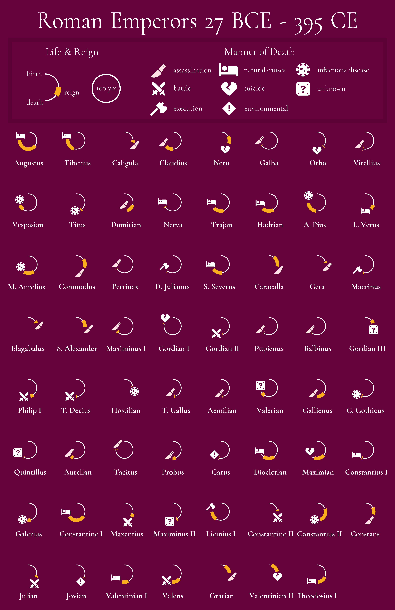

## Background

Here I juxtapose the reigns of a subset of Roman emperors against the (literal) arc of their lives.

Some things to note:

* The analysis here is superficial and I have not performed the kind of thorough consultation of sources necessary to formulate strong hypotheses or conclusions regarding emperors' manners of death. I am not a historian nor otherwise trained in historical methods, being simply a curious layperson with respect to history. Dates in the original dataset are also largely estimates, and so I therefore gladly invite corrections to these and other data where necessary.

* Dates here are sourced from a dataset compiled by others [here](https://github.com/zonination/emperors). Note in particular that the absolute values of BCE dates are decreased by 1 to conform to the ISO 8601 standard.
  - Thanks to [zonination](https://github.com/zonination) for creating this dataset.
  - Note: I did manually make some corrections to names in the final visualization.
 
* While I did rely on the aforementioned dataset for dates, I chose to review a different source for information on the deaths of emperors. I principally reviewed *[De Imperatoribus Romanis](https://isaw.nyu.edu/publications/awol-index/html/www.luc.edu/roman-emperors.html)*, a peer-reviewed encyclopedia of Roman rulers which I judged to be suitable for this project and which I noted as being used for a statistical analysis in a [recent scholarly publication](https://www.nature.com/articles/s41599-019-0366-y). It is recognized, however, that the writings there are generally decades old and may not reflect the most current scholarly consensus. Again, I invite corrections.

  - Thanks to Christian Körner, Christopher J. Fuhrmann, David Wend, David Woods, Dennis Quinn, Garrett G. Fagan, Geoffrey Nathan, Hans A. Pohlsander, Herbert W. Benario, John Donahue, Michael DiMaio, Jr., Michael L. Meckler, Noel Lenski, Phoebe B. Peacock, R. Scott Moore, Ralph W. Mathisen, Richard D. Weigel, Robert Frakes, Robin McMahon, Thomas Banchich, Walter E. Roberts, and William Leadbetter for their contributions to De Imperatoribus Romanis which I reviewed in annotating probable manner of death.
  - I additionally reviewed translations of documents including Suetonius's *Lives of the 12 Caesars*,  **Historia Augusta**, writings by Lactantius, Eusebius, Zosimus, and various modern scholarly publications. I link to some of these where relevant in `emperor_deaths.csv`.
    - Please note that these writings are products of the context of their times and the attitudes of their creators; authors may have agendas and biases that color their works, whether deliberately or unintentionally. We should therefore take care when attempting to use them to arrive at conclusions about an emperor's manner of death or anything else.

* I mapped the descriptions of emperors' deaths in De Imperatoribus Romanis to the same death classification scheme used in the original dataset's repository, as it seemed to reasonably capture the meaningful context of all emperors' deaths in the broad manner necessary for this visualization.

*  Invididuals are presented in the order in which they first rose to office, **not** the order in which they died.

* Finally, thanks to David Bacci for showcasing the [Coronation Arc chart](https://github.com/PBI-David/Deneb-Showcase/blob/main/Coronation%20Arc%20Chart/Thumbnail.png) marking the coronation of Charles III of the United Kingdom. I was immediately struck by the elegance of that visualization and I am grateful for the availability of his Vega specifications which inspired this project.

#### Please see emperors.ipynb for methodological details.

#### Update 2025-03-01
I posted the first iteration of this graphic to Reddit [here](https://www.reddit.com/r/dataisbeautiful/comments/1iw1qce/oc_visualizing_the_lifetimes_and_reigns_of_a/) and received very useful feedback. Thanks to all those who pointed out issues. Here are some notes on changes made and thoughts related to specific feedback: 

* Changed the icon for Nerva's death to *natural causes* instead of *assassination*. I did have the correct consensus manner of death recorded for Nerva, but placed the wrong icon when adding the iconography. Thanks to the user who spotted this.

* I received some feedback suggesting that one or more emperors may be in the wrong order because -for example- the graphic presents L. Verus after Marcus Aurelius despite Aurelius outliving Verus. It should be noted, however, that the graphic is not ordered by date of death, but rather date of ascension to the office of emperor. To help reduce confusion, I have added a note to that effect to this repository's ReadMe. However, in the case of Aurelius and Verus in particular, it appears that they both assumed office on the same day; given that Verus died before Aurelius, here I agree that it is a good idea to display him prior to Aurelius.
   - Please let me know if I made a mistake in order, given this context. I will also spend some time considering if simply presenting individuals in order of death would be more suitable. 

* It was suggested to add some indication of co-emperorship for clarity. I in principle think this is a good idea but think it may clutter the graphic a little more than I would like at present and so I'm holding off on implementing that for now. I will think longer on how I could accomplish that elegantly, as distinguishing co-emperorship adds another informative layer to a presently relatively uncluttered graphic that should be handled thoughtfully.

* It was noted that 'captivity' is not really a manner of death. This was something I included from the original dataset specifically for Valerian, as I initially thought that the context of his death in captivity would be important to present, despite the proximate cause of death being unclear. However, I agree that doing this causes unnecessary confusion, and so I have amended Valerian's manner of death to be 'unknown'. This has the benefit of removing an item from the legend which only applied to one individual, which to me does improve the elegance of the graphic.

* A new *infectious disease* category was added to clearly separate such cases from *natural causes*.
  
* A new *environmental* category was added to encompass one death by carbon monoxide poisoning and one by lightning strike. 

